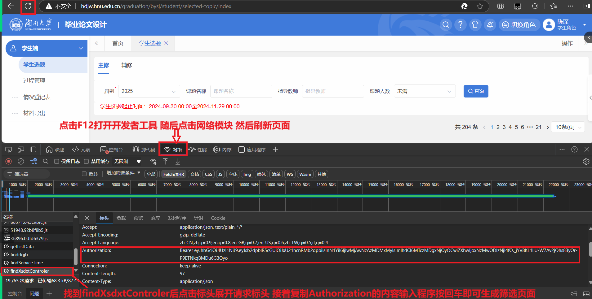

# 湖南大学毕业设计选题辅助筛选页面

这个项目是一个实时生成湖南大学毕业设计选题辅助筛选页面的代码。它能够帮助同学们更好地了解毕业设计选题的具体信息，并辅助选题过程。通过此工具，可以快速筛选和查看选题信息，方便做出合适的选择。

## 项目依赖

- `requests` — 用于向教务系统发送请求。
- `json` — 用于处理和解析JSON数据。

## 使用步骤

1. **运行程序**  
   运行`main.py`代码文件。

2. **打开教务系统选题页面**  
   在教务系统中，打开毕业设计选题页面。

3. **打开开发者工具**  
   按 `F12` 键打开浏览器的开发者工具，并切换到 **网络（Network）** 模块。

4. **刷新页面**  
   刷新选题页面，以便捕获请求。

5. **找到请求**  
   在 **网络** 模块中，找到 `findXsdxtControler` 请求。通常它出现在请求列表的最底部。

6. **复制 Authorization 内容**  
   点击 `findXsdxtControler` 请求，选择请求标头（Headers），找到其中的 **Authorization** 部分，复制其中的内容。

7. **输入 Authorization 内容**  
   将复制的 `Authorization` 内容输入到程序中。

8. **等待页面生成**  
   在程序生成选题页面内容前，请勿关闭教务系统的选题页面。

## 注意事项

- 请确保在执行程序时，不要关闭教务系统的选题页面，因为程序需要从该页面获取数据。
- 如果在执行过程中遇到问题，可以检查 `Authorization` 内容是否正确，或重新按照步骤进行操作。

## 开发和贡献

欢迎大家对项目提出建议和贡献代码。如果你发现了 bug 或有新的功能建议，欢迎在 GitHub 上提 issue 或提交 pull request。

## License

这个项目是开源的，使用 [MIT License](LICENSE) 许可证。

---

你可以根据项目的具体情况对以上内容进行修改。这个 `README.md` 文件提供了完整的使用步骤和项目概述，同时也包括了贡献和许可信息，符合开源项目的一般标准。
